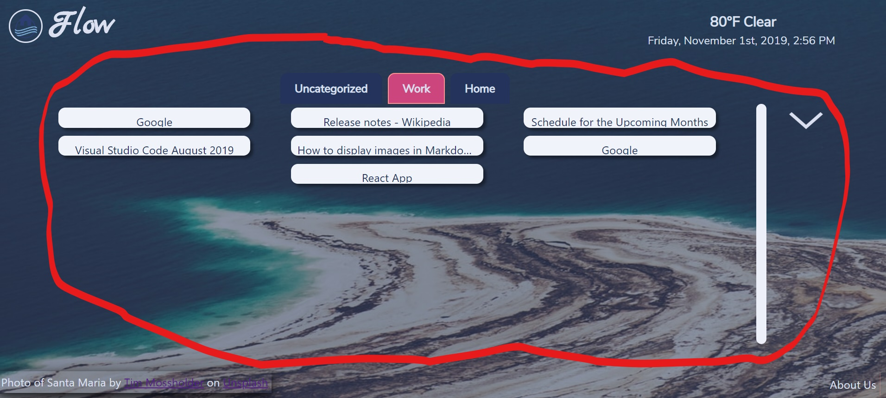
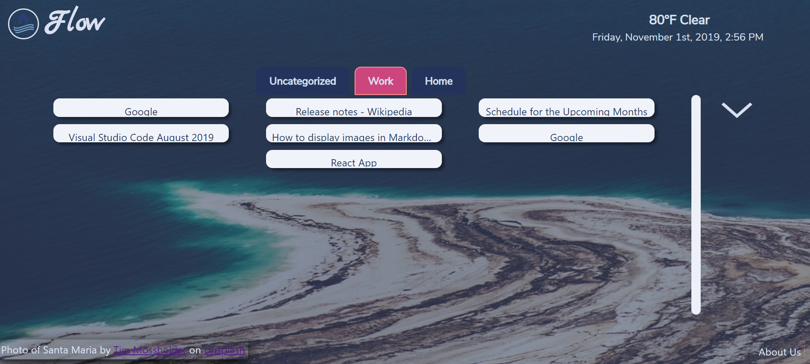
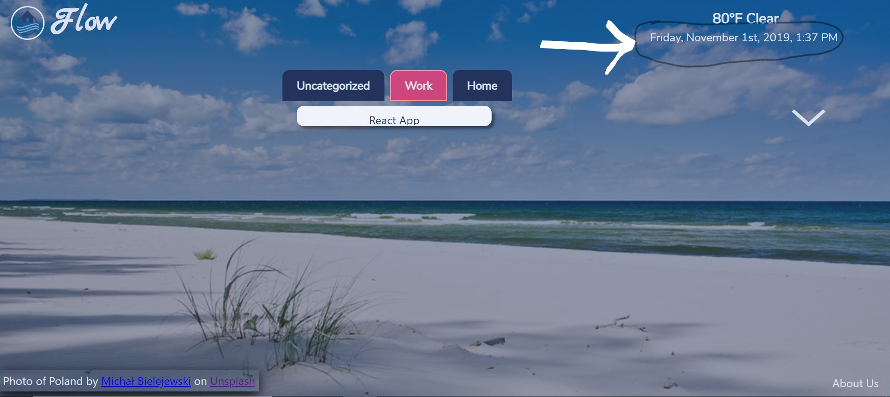
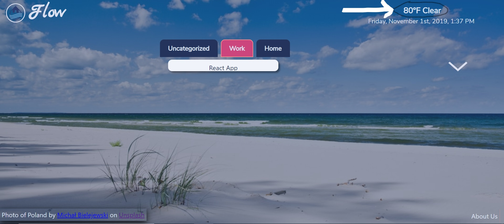

## **_RELEASE NOTES_**

### FLOW 2019 VERSION 1.0

# What is Flow?

- Flow is an application that intends to be an alternative homepage for chrome where a user can keep track of their history without having to look for it. 

### What works:

- **Chrome Extension**

  - This chrome extension plays in tandem with our application and is available for the users. This [Flow Homepage Helper](https://chrome.google.com/webstore/detail/flow-homepage-helper/jadklcjnechlbblefifkjodppcbckmlg) will provide the useful features of our application.

- **Tab Management**
  - The chrome extension keeps track of your history as soon as you close your tab.
  - The history that was captured can be seen in the category section at your homepage. 
- **Background brought to you by unsplash**
  - Enjoy a fresh set of background everytime you refresh the application. 
- **Time**
  - This application provides time according to your timezone.
- **Weather**
  - This application provides the weather according to your location. 

### Future Implementation:

- Allow the users have their own categories.
- Quotes that can motivate / inspire users.
- Implementing an AI to best categorize the user's history.
- Removal of unwanted tab from the history.
- Adding more Categories.
- Allowing users to sync tabs across different computers.
- Profiles

### BUGS:

- We have to make the logo a tag because
